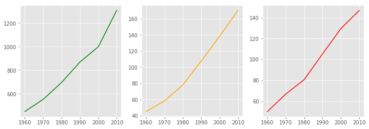
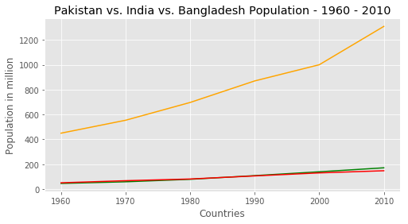
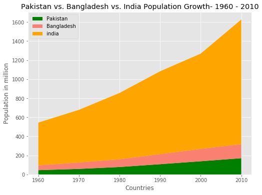

# Temporal Composition and Comparisons 
## Objectives

* Use and customize simple and multi-series line plots to show change over time
* Identify the use cases for stacked area charts
* Build, customize and output stakced area charts with matplotlib


## Background 

Out of all the data visualizations you see in newspapers, textbooks, and annual reports, like the graphs showing a country’s GDP growth trends or charts capturing a company’s sales growth over time would be high up on the list. Essentially, these are visualizations that track time series data i.e. **the performance of an indicator over a period of time** , also known as temporal visualizations.

Temporal visualizations are one of the simplest, quickest ways to represent important time series data. In this lesson, we shall look into some handy temporal visualization techniques for time series data. We have already seen barplots in detail which can be used for visualizing temporal data. However, the fixed width/length of barplots may not be suitable for inspecting trends over long periods of time and high resolution data (change over minutes/seconds). Instead we would use line plots and stacked area charts. 

## Line Graphs
We have already looked at line plots briefly with `.plot()` method. Here we shall look into these in a bit more detail. A line graph is the simplest way to represent temporal data. It is intuitive, easy to create, and helps the viewer get a quick sense of how something has changed over time.

A line graph uses points connected by lines (trend lines) to show how a **dependent variable** and **independent variable** changed i.e. how a company's profit (dependant) changes over time (independant). An independent variable like time remains unaffected by other parameters, whereas the dependent variable like profit value depends on how the independent variable changes. 

For temporal visualizations, time is always the independent variable, which is plotted on the horizontal axis. Then the dependent variable is plotted on the vertical axis. We can also plot multiple lines for a direct comparison between multiple entities on same axis. Let's look at an example below showing increade in population for three of the highly populated countries in Asia - India,  Pakistan and Bangladesh.


```python
# Import matplotlib
import matplotlib.pyplot as plt
plt.style.use('ggplot')
```

Let's borrow some sample data from World Bank statistics as shown below:


```python
# World population data taken from world bank stats. 
year = [1960, 1970, 1980, 1990, 2000, 2010]
pop_pakistan = [44.91, 58.09, 78.07, 107.7, 138.5, 170.6]
pop_india = [449.48, 553.57, 696.783, 870.133, 1000.4, 1309.1]
pop_bangla = [50.1, 66.88, 80.62, 105.3, 129.6, 147]
```

As a first step, we can create subplots to show each of these lines in separate axes as that might help towards visual analyses in some cases. 


```python
# Create a new figure with a 3 axes along columns
fig, ax =  plt.subplots(ncols = 3, figsize=(12,4))
ax[0].plot(year, pop_india, color='green')
ax[1].plot(year, pop_pakistan, color='orange')
ax[2].plot(year, pop_bangla, color='red')
plt.show()
```





Here, we can see that due to the difference in the range of population values for these countries, the increasing trend appears to be the same. However, looking at the y-axis, we can clearly see that each subplot is showing a different range as hence not directly comparable. Let's try plotting all these lines on a single plot for direct comparison.


```python
# Create a new figure with a single axis
fig, ax =  plt.subplots(figsize=(8,4))

# Plot the data for india and pakistan on the same axes
ax.plot(year, pop_pakistan, color='green')
ax.plot(year, pop_india, color='orange')
ax.plot(year, pop_bangla, color='red')


#Set the x and y labels
ax.set_xlabel('Countries')
ax.set_ylabel('Population in million')

# Set the plot title and show the final plot
plt.title('Pakistan vs. India vs. Bangladesh Population - 1960 - 2010')
plt.show()

```





This makes much more sense as India is hugely populated when compared to Pakistan and Bangladesh. We can further improve this visualization using stacked area charts to allow direct comparison and also, an overall increase in population for the three countries. 

## Stacked Area charts

An area chart is similar to a line chart in that it has points connected by straight lines on a two-dimensional chart. It also puts time as the independent variable on the x-axis and the dependent variable on the y-axis. However, in an area chart, multiple variables are “stacked” on top of each other, and the area below each line is colored to represent each variable. Area charts are useful to show how both an overall total and individual components of that total changed over time.

Let's re-visit above example and draw a stacked area chart for populations of india and Pakistan. We shall create a new list containing populations over time both countries as individual lists (note that length of the lists must be same for the stacked area chart). We shall plot this using the `.stackplot()` method from matplotlib by passing the combined list with individual elements (lists) to be stacked on top of each other. 


```python
#Combine the population as a list of lists
pop =[ pop_pakistan, pop_bangla, pop_india ]
print(pop)

# Create a new figure with a single axis
fig, ax =  plt.subplots(figsize=(8,6))

# Basic stacked area chart. Use primary flag colos to represent each country
ax.stackplot(year, pop, labels=['Pakistan', 'Bangladesh', 'india' ], colors = ['green',  'salmon', 'orange'])
ax.legend(loc='upper left')

#Set the x and y labels
ax.set_xlabel('Countries')
ax.set_ylabel('Population in million')

# Set the plot title and show the final plot
plt.title('Pakistan vs. Bangladesh vs. India Population Growth- 1960 - 2010')
plt.show()
```

    [[44.91, 58.09, 78.07, 107.7, 138.5, 170.6], [50.1, 66.88, 80.62, 105.3, 129.6, 147], [449.48, 553.57, 696.783, 870.133, 1000.4, 1309.1]]





Here you can see the output shows the overall growth in population by stacking the growth of countrys' populations on top of each other. This helps with multidimensional analysis of data. 

### Summary

In this lesson, we saw how to visualize temporal data using different entities to show and compare the changes over time. We mainly looked at drawing and customizing line plots and stacked area charts. 
